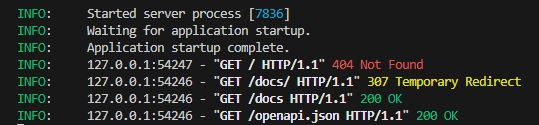

# API RESTful - Analyse de Sentiments

## Objectif
Analyser les sentiments des commentaires clients sur des produits en utilisant NLTK VADER.

## Installation
```bash
pip install -r requirements.txt
```

## Lancement de l’API
```bash
python -m uvicorn main:app --reload
```

## Endpoints disponibles
- POST /products
- GET /products
- GET /products/{id}
- POST /reviews
- GET /reviews/product/{id}
- GET /products/{id}/sentiment_summary



 👉 Pas de endpoint défini @app.get("/") dans le main.py, alors FastAPI  retourne 404 Not Found
 
 ➡️ FastAPI déclenche un 307 quand tu oublies un / final dans l’URL d’un endpoint.
